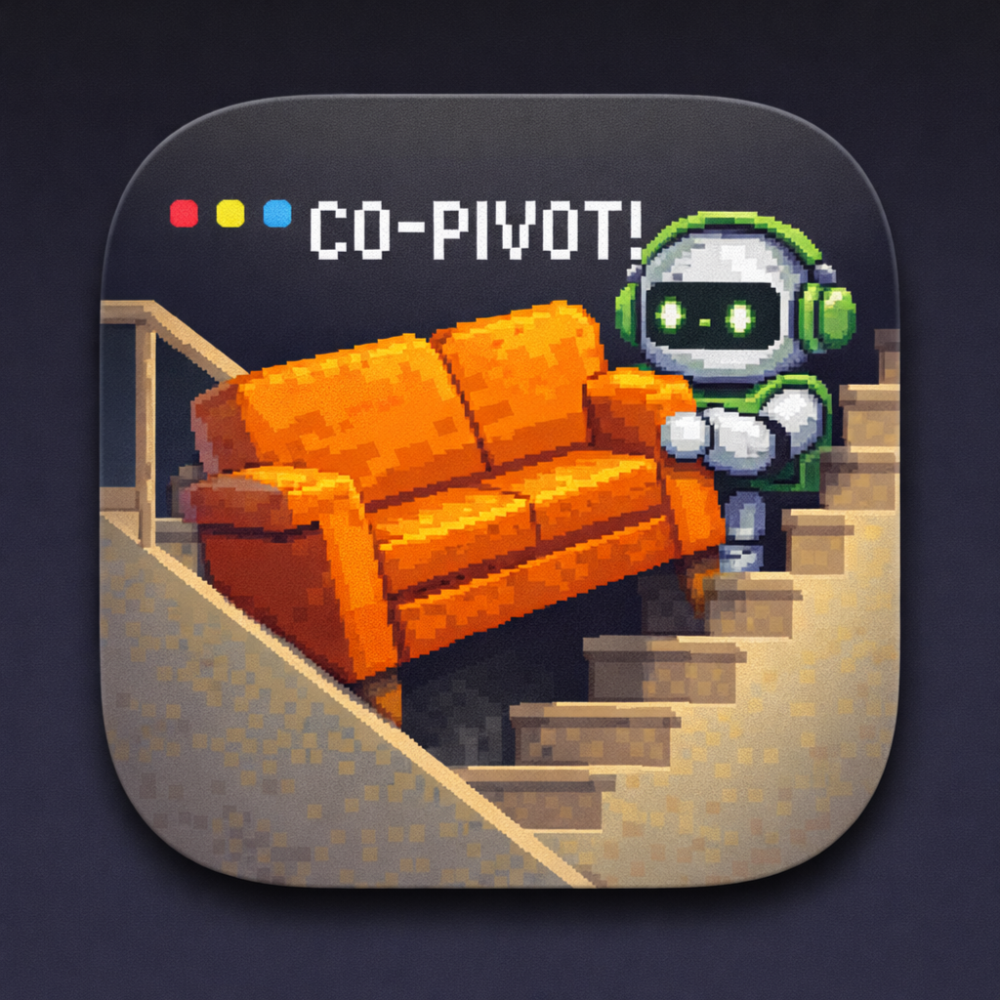

# co-pivot

<p align="center">
  
</p>

co-pivot is a local-first desktop app for finding, understanding, and resuming GitHub Copilot CLI conversations with less friction.

## What it does today

- Runs as a local desktop app built with `Electron + React + Mantine`
- Reads GitHub Copilot CLI sessions from `~/.copilot/session-state`
- Helps you browse, search, and identify the right conversation to resume across parallel tasks
- Supports custom titles, favorites, chronological browsing, and side-by-side comparison
- Adds lightweight recovery aids like resume notes, richer session detail, and chat-style transcript browsing
- Reopens the selected session in `iTerm` or `Terminal.app` with `copilot --resume <session-id>`

## Current architecture

- `src/`: React UI, local search, session detail views, and recovery workflows
- `electron/main.cjs`: Electron main process, local session discovery, terminal preference persistence, periodic refresh wiring, and resume action
- `electron/preload.cjs`: secure bridge between Electron and the renderer
- `src/features/sessions/`: session models, search ranking, local metadata, notes, sorting, and resume wiring

## Local development

### Prerequisites

- `bun`
- GitHub Copilot CLI installed if you want the `Resume` action to work
- `iTerm` installed if you want to use `iTerm` as the preferred terminal

### Install dependencies

```bash
bun install
```

### Run the app

```bash
bun run dev
```

This starts Vite and Electron together.

### Type-check

```bash
bun run lint
```

## Build a macOS app

co-pivot can now be packaged as a real macOS application that you can move into `Applications` and launch from an app icon.

### Create a packaged app

```bash
bun run dist:dir
```

This produces a packaged `.app` bundle inside `release/mac-arm64`.

### Create distributable archives

```bash
bun run dist
```

This builds the app and generates macOS artifacts in `release/`, including a DMG.

### Install it in Applications

1. Run `bun run dist:dir`
2. Open `release/mac-arm64`
3. Find `co-pivot.app`
4. Drag `co-pivot.app` into `Applications`
5. Launch it from Launchpad, Spotlight, Finder, or the Applications folder

You can also open the packaged app directly from the terminal:

```bash
open /Users/aiheon/Developper/co-pivot/release/mac-arm64/co-pivot.app
```

If macOS blocks the first launch, right-click the app, choose `Open`, then confirm.

## Notes

- co-pivot currently targets GitHub Copilot CLI only.
- Session discovery is based on the local Copilot session-state format, so we should expect that format to evolve over time.
- `Resume` opens a new terminal window/tab and keeps co-pivot open.
- The UI is intentionally optimized for fast task recovery: finding the right conversation, understanding where it left off, and resuming it quickly.
- The preferred terminal is stored locally in Electron user data.
- Session-specific helpers like custom titles and resume notes are stored locally.
- The packaged macOS app targets Apple Silicon (`arm64`).
